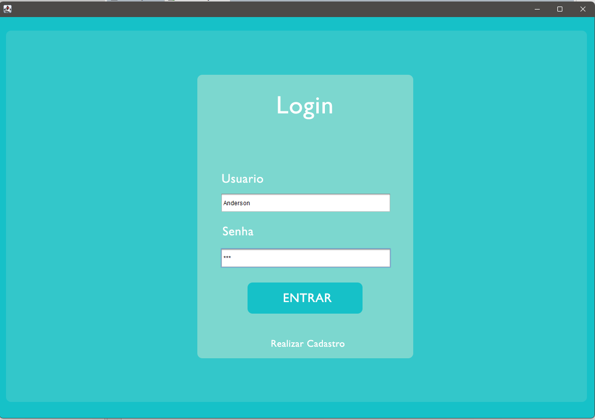
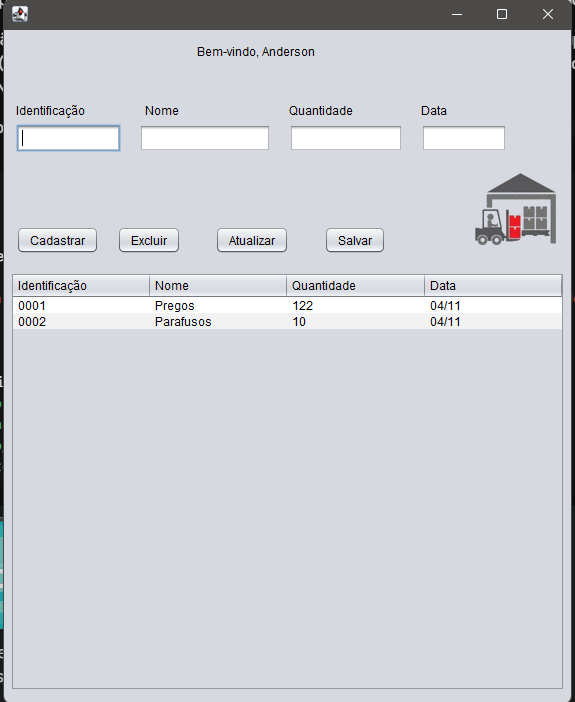

# 🏗️ Sistema de Gerenciamento de Estoque - Materiais de Construção

> Aplicação Desktop desenvolvida em Java (Swing) para o controle prático, seguro e eficiente do estoque de uma loja de materiais de construção. Projeto desenvolvido para fins acadêmicos utilizando a IDE NetBeans.

---

## 📌 Índice
* [Sobre o Projeto](#-sobre-o-projeto)
* [Funcionalidades](#-funcionalidades)
* [Interface Gráfica (UI)](#-interface-gráfica-ui)
* [Tecnologias Utilizadas](#-tecnologias-utilizadas)
* [Como Executar o Projeto](#-como-executar-o-projeto)
* [Autores](#-autores)

---

## 💻 Sobre o Projeto

O projeto foi idealizado para resolver um problema comum em pequenas e médias lojas de materiais de construção: a falta de controle centralizado sobre as mercadorias disponíveis. 

A aplicação conta com um sistema de autenticação seguro e um painel administrativo intuitivo que permite realizar o mapeamento completo de insumos (como pregos, parafusos, ferramentas e cimento), registrando identificação única, quantidades e datas de movimentação.

---

## ⚙️ Funcionalidades

* **Sistema de Autenticação (Login):** Tela de acesso restrito para usuários cadastrados garantindo a segurança dos dados.
* **Módulo de Cadastro de Usuários:** Opção para novos usuários realizarem o cadastro no sistema.
* **Controle de Estoque (CRUD Completo):**
  * **Cadastrar:** Adiciona novos produtos especificando Identificação, Nome, Quantidade e Data.
  * **Excluir:** Remove itens obsoletos ou zerados do fluxo de dados.
  * **Atualizar:** Permite a edição rápida de informações de itens já existentes.
  * **Salvar:** Consolida as alterações feitas no banco de dados ou estrutura de persistência.
* **Painel Personalizado:** Saudação dinâmica ao usuário logado no sistema (Ex: *"Bem-vindo, Anderson"*).
* **Visualização em Tabela:** Listagem organizada e em tempo real de todas as mercadorias disponíveis no estoque.

---

## 📸 Interface Gráfica (UI)

O sistema foi desenvolvido utilizando componentes visuais customizados para proporcionar uma experiência limpa e profissional ao usuário:

### 1. Tela de Login e Acesso
*Design moderno e responsivo com campos para credenciais e atalho para novos cadastros.*
<p align="center">
  
</p>

### 2. Painel Principal de Estoque
*Ambiente centralizado para gerenciamento de produtos com tabela dinâmica de controle.*
<p align="center">
  
</p>

---

## 🛠️ Tecnologias Utilizadas

| Tecnologia | Função no Projeto |
| :--- | :--- |
| **Java JDK** | Linguagem de programação base do ecossistema. |
| **Java Swing / AWT** | Construção das telas, tabelas, botões e design da interface gráfica (GUI). |
| **NetBeans IDE** | Ambiente de desenvolvimento integrado e ferramenta de design de telas. |

---

## 🚀 Como Executar o Projeto

### Pré-requisitos
Antes de começar, você vai precisar ter instalado em sua máquina:
* **Java JDK** (Versão 8 ou superior recomendado).
* Uma IDE de preferência (altamente recomendado o **NetBeans** devido ao layout Swing).

### 🔧 Passo a Passo para Execução

```bash
# 1. Clone este repositório para a sua máquina local
$ git clone [https://github.com/seu-usuario/seu-repositorio.git](https://github.com/seu-usuario/seu-repositorio.git)

# 2. Abra o NetBeans IDE

# 3. Vá em File > Open Project (Arquivo > Abrir Projeto) e selecione a pasta clonada

# 4. Localize o arquivo principal de inicialização (geralmente a tela de Login ou a classe Main)

# 5. Clique com o botão direito no projeto e selecione "Run" (Executar) ou pressione F6
```
✍️ Autor
Desenvolvido por Anderson De Andrade — Estudante de Ciência da Computação e Desenvolvedor de Software Java
